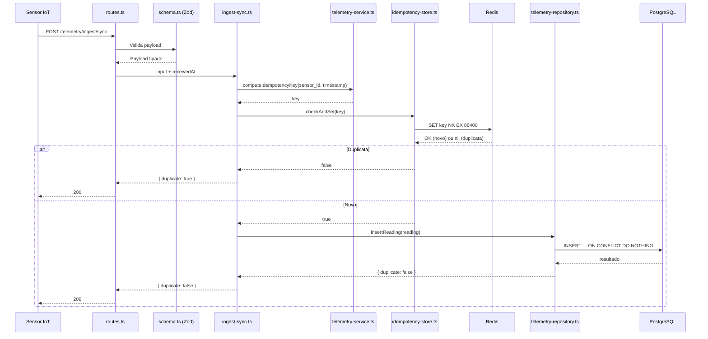
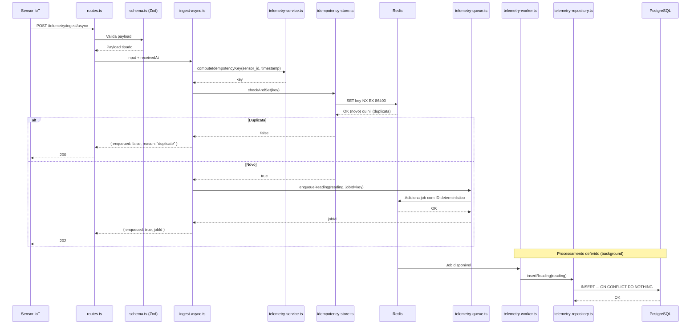
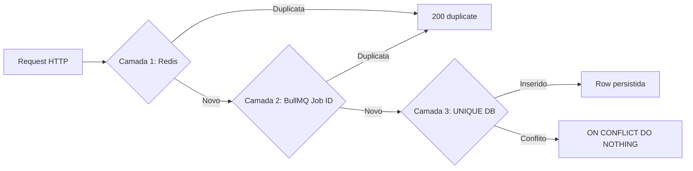

# SARTA — Módulo Telemetry

O módulo `telemetry` é o **núcleo experimental** do SARTA. Ele recebe leituras individuais de sensores hidrológicos (pluviometria, nível fluvial, temperatura, pressão atmosférica) instalados em estações da bacia do Rio Una e as persiste no banco de dados por duas rotas distintas — síncrona e assíncrona — para que o TCC possa comparar o desempenho de cada abordagem sob carga.

Para a visão geral do sistema e a hipótese experimental, consulte o `ARCHITECTURE.md` na raiz do projeto. Para o guia de implementação passo a passo, consulte o `TELEMETRY_GUIDE.md` nesta mesma pasta.

---

## 1. Papel Experimental do Módulo

Este módulo serve um papel duplo: é uma feature real (ingestão de dados de um sistema de monitoramento IoT) e ao mesmo tempo o experimento controlado do TCC.

A coluna `ingestion_route` na tabela do banco de dados é a **variável independente** do experimento. Toda leitura persistida é marcada como `'SYNC'` ou `'ASYNC'`, permitindo segmentar os dados por rota de ingestão nas análises posteriores.

Ambas as rotas recebem payloads idênticos e produzem rows idênticas no banco. A única diferença é o **caminho de processamento**: gravação direta (síncrona) vs enfileiramento e processamento em background (assíncrona). Isso permite que o mesmo script de load test ataque ambas as rotas (em rodadas separadas), tornando a comparação justa.

O cenário de carga simula **500 estações equipadas com 4 sensores cada** que, após uma queda de conectividade, restabelecem o enlace simultaneamente e descarregam em rajada (janela de 15 s) as medições acumuladas. Em vez de um único volume fixo, o experimento varre **cinco cenários progressivos (C1–C5)**, calibrados por durações de desconexão plausíveis (sensores coletam a cada 10 min, padrão CEMADEN):

| Cenário | Fenômeno | Desconexão | Leituras/sensor | Total de reqs | Taxa (total ÷ 15 s) |
|---|---|---|---|---|---|
| C1 | Oscilação breve de sinal | 10 min | 1 | 2.000 | ~133 req/s |
| C2 | Interferência moderada | 30 min | 3 | 6.000 | ~400 req/s |
| C3 | Queda sustentada | 1 h | 6 | 12.000 | ~800 req/s |
| C4 | Interrupção severa (DOL ativo) | 2 h | 12 | 24.000 | ~1.600 req/s |
| C5 | Dano à infraestrutura (evento 2010) | 4 h | 24 | 48.000 | ~3.200 req/s |

Cada requisição carrega uma única leitura de um único sensor. Cada cenário roda nas duas rotas (sync e async) em rodadas separadas → **10 rodadas**, em ordem aleatorizada, com **warm-up descartado (10% do volume)** antes de cada uma e limpeza de banco + Redis entre elas.

As métricas que o experimento medirá (em fase posterior):

- **Throughput** — leituras por segundo que cada rota sustenta
- **Latência de cauda (p95/p99)** — tempo de resposta nos piores cenários (métrica primária)
- **Taxa de erros** — percentual de respostas HTTP 4xx/5xx sob carga crescente
- **Latência interna** — `created_at - received_at` (lida do PostgreSQL); para a async, é o `queue_time + processing_time`
- **Ponto de inflexão** — primeiro cenário em que a rota ultrapassa 1% de 5xx ou um limiar operacional de p99; marca a fronteira de viabilidade entre sync e async

> A descrição completa e a fundamentação acadêmica do desenho experimental estão em `TCC_CONTEXT.md` (raiz do projeto).

---

## 2. Fluxo de Ingestão Síncrona



**Passo a passo:**

1. O sensor envia um HTTP POST para `/telemetry/ingest/sync` com uma leitura individual: `{ sensor_id, timestamp, value }`.
2. O Fastify aciona o validador Zod de `schema.ts`. Se o payload for inválido, retorna 400 imediatamente — nenhum código de domínio executa.
3. O dado validado entra no use case `ingest-sync.ts`, junto com o `received_at` capturado no handler.
4. O use case chama a função pura `computeIdempotencyKey` do `telemetry-service.ts` para gerar a chave de deduplicação.
5. O use case chama `checkAndSet` do `idempotency-store.ts`, que executa um `SET NX EX` atômico no Redis. Se a chave já existir, a leitura é duplicata — o use case retorna early.
6. Se é uma leitura nova, o use case monta o `TelemetryReading` (adicionando `ingestion_route: 'SYNC'` e `received_at`) e chama `insertReading` do repositório.
7. O repositório insere no PostgreSQL com `ON CONFLICT DO NOTHING` (Camada 3 de idempotência). Retorna se a row foi efetivamente inserida ou ignorada.
8. A rota responde com **200** e o resultado: `{ duplicate: false }` para dado novo ou `{ duplicate: true }` para duplicata.

**Nota sobre a Camada 2:** A rota síncrona não passa pela Camada 2 (Job ID determinístico do BullMQ) porque não usa fila — o dado vai direto do use case ao repositório. A Camada 2 é exclusiva da rota assíncrona, onde o BullMQ é o intermediário. Na rota síncrona, a defesa é: Camada 1 (Redis) → Camada 3 (UNIQUE do banco).

**Característica chave:** A conexão HTTP permanece aberta durante toda a duração dos passos 3 a 8. O sensor precisa esperar a gravação no banco completar antes de receber a resposta.

---

## 3. Fluxo de Ingestão Assíncrona



**Passo a passo:**

1. O sensor envia o mesmo HTTP POST, agora para `/telemetry/ingest/async`.
2. Mesma validação Zod.
3. O dado validado entra no use case `ingest-async.ts`.
4. O use case computa a chave de idempotência e faz `checkAndSet` no Redis — mesmo mecanismo da rota síncrona.
5. Se duplicata → retorna `{ enqueued: false, reason: "duplicate" }` com status **200**. Nada é enfileirado.
6. Se novo → o use case monta o `TelemetryReading` e chama `enqueueReading` do `telemetry-queue.ts`, passando a chave de idempotência como **job ID determinístico**. O BullMQ rejeita jobs com ID duplicado (Camada 2 de idempotência).
7. Assim que o Redis confirma que o job foi enfileirado (sub-milissegundo), o use case retorna. A rota responde com **202 Accepted** e o ID do job.
8. A conexão HTTP é liberada aqui. O sensor está livre.
9. Posteriormente (milissegundos a segundos, dependendo da carga), o `telemetry-worker.ts` retira o job da fila.
10. O worker chama o `telemetry-repository.ts` — a **mesma função** que a rota síncrona usa — para persistir a leitura com `ON CONFLICT DO NOTHING` (Camada 3).
11. Se o worker falhar, o mecanismo de retry do BullMQ re-enfileira o job com backoff exponencial.

**Trade-off:** A rota assíncrona responde mais rápido, mas introduz **consistência eventual** — os dados não estão no PostgreSQL quando o sensor recebe a resposta. Para monitoramento hidrológico isso é aceitável: dashboards e alertas consultam o banco, e alguns segundos de atraso não são críticos para segurança. Porém, a resposta não pode incluir IDs das rows do banco (porque elas ainda não existem).

---

## 4. Estrutura do Módulo (Camada por Camada)

```
src/modules/telemetry/
├── routes.ts                      # Ponto de entrada: plugin Fastify
├── schema.ts                      # Contrato HTTP: schemas Zod
├── domain/
│   ├── types.ts                   # Fonte de verdade: interfaces TypeScript
│   └── services/
│       └── telemetry-service.ts   # Funções puras de negócio
├── use-cases/
│   ├── ingest-sync.ts             # Orquestração: idempotency → repository
│   └── ingest-async.ts            # Orquestração: idempotency → queue
├── providers/
│   ├── telemetry-repository.ts    # Adaptador: Drizzle ORM (PostgreSQL)
│   ├── telemetry-queue.ts         # Adaptador: BullMQ producer (Redis)
│   ├── idempotency-store.ts       # Adaptador: Redis SET NX EX (dedup)
│   └── telemetry-job-codec.ts     # Codec: domínio ↔ DTO de fio (Date ↔ string ISO)
├── workers/
│   └── telemetry-worker.ts        # Consumidor: BullMQ → repository
├── TELEMETRY.md
└── TELEMETRY_GUIDE.md
```

### 4.1 routes.ts (Ponto de Entrada HTTP)

Um plugin Fastify que registra as rotas POST `/ingest/sync` e `/ingest/async`. Importa os schemas Zod para validação e os use cases para processamento. Não contém lógica de negócio — sua única responsabilidade é conectar concerns HTTP (parsing de request, códigos de resposta) aos use cases. É também onde o worker BullMQ é inicializado e conectado ao lifecycle do Fastify (via hook `onClose` para graceful shutdown).

### 4.2 schema.ts (Contrato HTTP)

Contém os schemas Zod que definem a forma válida de requests e responses HTTP. O Zod vive **exclusivamente** aqui. Código de domínio nunca importa deste arquivo.

Os schemas Zod e as interfaces TypeScript em `domain/types.ts` descrevem formas parecidas (ambos usam camelCase: `sensorId`, `timestamp`, `value`). Essa duplicação é **intencional**: o Zod é um artefato de runtime ligado à camada HTTP (validação), enquanto as interfaces são artefatos de compile-time ligados à lógica de negócio (type safety). Acoplá-los faria o domínio depender de uma biblioteca de validação HTTP.

### 4.3 domain/types.ts (Fonte de Verdade dos Tipos)

Contém interfaces e tipos TypeScript puros — zero dependências externas. Os 4 tipos de sensor são definidos como um array `as const`, e o tipo union é derivado automaticamente dele. Todas as propriedades usam `readonly` para sinalizar imutabilidade no nível do tipo. Todo arquivo do módulo importa tipos daqui.

### 4.4 domain/services/ (Funções Puras)

Funções que implementam regras de negócio. **Puras** significa: dado o mesmo input, retornam sempre o mesmo output, e não leem nem escrevem nada externo (sem banco, sem Redis, sem `Date.now()`, sem logging). As funções principais computam a chave de idempotência e validam ranges de sensores. Esta é a parte mais testável do módulo — testes não precisam de mocks, setup ou teardown.

### 4.5 use-cases/ (Orquestração)

Cada use case é uma função que orquestra lógica de domínio e infraestrutura. O `ingest-sync.ts` compõe: idempotency check → domain service → repository. O `ingest-async.ts` compõe: idempotency check → domain service → queue. Use cases são a **única camada que conhece ambos** — domínio e providers. São finos: a lógica vive nos services, o I/O vive nos providers. O use case só sequencia.

### 4.6 providers/ (Infraestrutura I/O)

Adaptadores para o mundo externo. O `telemetry-repository.ts` encapsula queries Drizzle ORM para PostgreSQL (insert com `ON CONFLICT DO NOTHING`, consultas por sensor e por rota). O `telemetry-queue.ts` encapsula o BullMQ producer (criação de jobs com ID determinístico, retry e backoff). O `idempotency-store.ts` encapsula a operação atômica `SET NX EX` no Redis para deduplicação. Se PostgreSQL fosse substituído por outro banco, só o repository muda. Se BullMQ fosse substituído por RabbitMQ, só o queue muda. Use cases e domínio permanecem intocados.

O `telemetry-job-codec.ts` é o **codec da fila**: traduz entre o tipo de domínio (`NewTelemetryReading`, com datas como `Date`) e o DTO de fio (`TelemetryReadingJobData`, com datas como `string` ISO). A fila é uma fronteira de serialização — um `Date` não sobrevive a um round-trip `JSON.stringify`/`JSON.parse` como `Date`, volta como string. O codec torna essa tradução **explícita e tipada** nas duas pontas: `toJobData` (Date→string) é chamado pelo produtor antes do `queue.add`, e `fromJobData` (string→Date) é chamado pelo worker antes do `insertReading`. Ambos importam o mesmo tipo e as mesmas funções daqui (fonte única, sem risco de drift). É o mesmo princípio do `toDomain` que o repositório usa na borda do banco — **cada adaptador é dono da tradução entre o domínio e o seu próprio formato, sempre apontando para dentro**. O codec mora nos providers (não no domínio) justamente porque conhecer o formato de fio da fila é uma preocupação de transporte, não de negócio.

### 4.7 workers/ (Consumidor da Fila)

Uma instância de BullMQ Worker que escuta a fila de telemetria. Quando um job chega, extrai a leitura e chama o repositório — **a mesma função** `insertReading` que a rota síncrona usa (com `ON CONFLICT DO NOTHING` como rede de segurança). O worker roda no mesmo processo que o servidor Fastify, inicializado dentro do plugin. É intencionalmente simples: toda validação e deduplicação já foi feita antes do enfileiramento.

> **Nota:** Em produção, o worker tipicamente rodaria em processo separado para isolamento (crash do worker não afeta o servidor HTTP). Para o TCC, o mesmo processo simplifica o setup.

---

## 5. Contrato de Payload (Leitura Individual)

Cada requisição HTTP carrega **uma única leitura de um único sensor**. Isso reflete o comportamento real de firmware IoT simples com memória limitada, onde cada sensor transmite suas leituras independentemente. No cenário de reconexão, o sensor envia suas leituras acumuladas como uma sequência de requests individuais.

```json
{
  "sensorId": "SNS-001-RAIN",
  "timestamp": "2025-06-02T12:00:00Z",
  "value": 2.8
}
```

**Regras do contrato:**

- `sensorId` é um identificador textual (camelCase no payload HTTP, mapeado para `sensor_id` no banco). O sensor deve estar pré-cadastrado na tabela `sensors` antes de enviar telemetria. Se o `sensorId` não existir no banco, o use case retorna **422 Unprocessable Entity** com o erro serializado no formato BaseError. Essa validação é feita no use case antes do insert, não delegada ao erro bruto de FK do PostgreSQL — a mensagem de FK violation do Postgres é ilegível para debugging e para o firmware do sensor.
- `timestamp` é uma string ISO 8601 que indica quando o sensor fisicamente coletou a medição.
- `value` é um número real ou `null`. O `null` representa falha ou ausência de leitura (comportamento realista em IoT — sensores podem falhar em leituras individuais).
- O par `(sensorId, timestamp)` identifica univocamente uma leitura. Enviar o mesmo par duas vezes é tratado como duplicata e deduplicado pelas camadas de idempotência.

**Justificativa do formato individual:** Comparado com um payload batch (onde uma estação envia múltiplas leituras de múltiplos sensores em um único POST), requests individuais maximizam o estresse HTTP no sistema (~40.000 conexões vs ~10.000 se fosse batch), evidenciando melhor a diferença entre rota síncrona e assíncrona. Além disso, simplificam a chave de idempotência (`sensor_id:timestamp`, sem arrays) e refletem com mais fidelidade o comportamento de firmware IoT simples.

---

## 6. Esquema de Banco de Dados

### 6.1 Tabela `stations`

| Coluna | Tipo | Descrição |
|---|---|---|
| id | integer, identity (generated always) | PK auto-incremento (uso interno) |
| station_id | varchar(256), unique | Identificador externo (ex: STN-001) |
| name | text | Nome descritivo da estação |
| municipality | text | Município da bacia do Rio Una |
| latitude | real | Coordenada geográfica |
| longitude | real | Coordenada geográfica |
| elevation_m | real | Elevação em metros |
| created_at | timestamptz | Data de cadastro (default: now) |

A `station_id` é o campo referenciado pela FK da tabela `sensors`. É uma referência a uma coluna UNIQUE, não à PK (`id`), porque é o valor usado nas relações externas.

### 6.2 Tabela `sensors`

| Coluna | Tipo | Descrição |
|---|---|---|
| id | integer, identity (generated always) | PK auto-incremento (uso interno) |
| sensor_id | varchar(256), unique | Identificador externo (ex: SNS-001-RAIN) |
| station_id | varchar(256), FK → stations.station_id | Estação à qual o sensor pertence |
| sensor_type | pgEnum('RAIN' \| 'LEVEL' \| 'TEMPERATURE' \| 'PRESSURE') | Tipo do sensor |
| unit | varchar | Unidade de medida (mm, m, °C, hPa) |
| created_at | timestamptz | Data de cadastro (default: now) |

Cada estação possui 4 sensores, um de cada tipo:
- **RAIN** — pluviômetro, mede precipitação em milímetros (mm)
- **LEVEL** — linímetro, mede nível fluvial em metros (m)
- **TEMPERATURE** — sensor de temperatura em graus Celsius (°C)
- **PRESSURE** — barômetro, mede pressão atmosférica em hectopascais (hPa)

Modelar sensores como entidade separada (não embutidos na estação com colunas fixas) reflete o comportamento real de sistemas como o CEMADEN e a ANA, onde cada sensor transmite e falha independentemente. Também permite adicionar novos tipos de sensor sem migração de schema.

### 6.3 Tabela `telemetry_readings`

| Coluna | Tipo | Descrição |
|---|---|---|
| id | integer, identity (generated always) | PK auto-incremento |
| sensor_id | varchar(256), FK → sensors.sensor_id | Sensor que gerou a leitura |
| timestamp | timestamptz | Quando o sensor fez a medição |
| value | real, nullable | Valor da medição (null = falha do sensor) |
| ingestion_route | pgEnum('SYNC' \| 'ASYNC') | Rota de ingestão (variável do experimento) |
| received_at | timestamptz | Quando o servidor recebeu o HTTP request |
| created_at | timestamptz | Quando a row foi inserida no PostgreSQL (default: now) |

A FK `sensor_id` referencia **`sensors.sensor_id`** (coluna UNIQUE do tipo varchar), **não** `sensors.id` (PK identity). A razão é a mesma da FK `stations.station_id` na tabela `sensors`: o `sensor_id` textual é o valor que chega no payload HTTP e que identifica o sensor em todas as relações externas. A PK `id` é uso interno do banco.

**UNIQUE constraint em `(sensor_id, timestamp)`** — garante que o mesmo sensor não pode ter duas leituras no mesmo instante. Essa é a Camada 3 da estratégia de idempotência (ver seção 10). O `ingestion_route` **não** faz parte do UNIQUE porque o mesmo dado físico (mesmo sensor, mesmo instante) é duplicata independente da rota de entrada. Para o experimento, os testes das duas rotas são executados em rodadas separadas.

**Sobre a coluna `ingestion_route`:** Essa coluna existe exclusivamente para **análise experimental post-hoc** — permite segmentar as métricas por rota de ingestão (ex: `SELECT ingestion_route, percentile_cont(0.95) WITHIN GROUP (ORDER BY ...) FROM telemetry_readings GROUP BY ingestion_route`). Ela não participa de nenhuma lógica de negócio, não faz parte de constraints de idempotência, e não afeta o fluxo de ingestão. É uma tag analítica. Os valores do enum são `'SYNC'` e `'ASYNC'` (UPPERCASE, consistente com a convenção do projeto para enums PostgreSQL).

### 6.4 Três Timestamps para Análise de Latência

Os três campos temporais permitem medir a latência em cada estágio:

- **timestamp** — quando o sensor fisicamente coletou o dado
- **received_at** — quando o servidor HTTP recebeu a requisição
- **created_at** — quando a row foi efetivamente inserida no PostgreSQL

Para a rota síncrona, `received_at` e `created_at` serão quase idênticos (a diferença é o tempo de processamento). Para a rota assíncrona, haverá um gap entre eles — esse gap é exatamente o tempo de permanência na fila (`queue_time + processing_time`), uma das métricas centrais do experimento.

### 6.5 Índices

- **UNIQUE `(sensor_id, timestamp)`** — idempotência (Camada 3) + consultas de série temporal por sensor (duplo propósito). Também cobre consultas por `sensor_id` isolado (leftmost prefix do índice composto).
- **`timestamp`** — consultas por janela temporal cruzando todos os sensores (ex: "todas as leituras da última hora"). O índice composto UNIQUE não atende essas queries porque `sensor_id` é a coluna mais à esquerda.

**Índices descartados:**
- `sensor_id` standalone — redundante, coberto pelo leftmost prefix do UNIQUE composto.
- `ingestion_route` — cardinalidade muito baixa (2 valores). O PostgreSQL prefere sequential scan, tornando um B-tree index ineficaz para ~40.000 rows.

---

## 7. Conceitos de Programação Funcional Utilizados

Este módulo aplica conceitos de programação funcional de forma pragmática. Abaixo está um resumo; o `TELEMETRY_GUIDE.md` explica cada conceito em detalhe no passo em que ele aparece.

| Conceito | Onde aparece | Por que é útil aqui |
|---|---|---|
| **Funções puras** | `domain/services/` | Computação de chave de idempotência e validação de ranges são determinísticas e sem side effects. Trivialmente testáveis. |
| **Imutabilidade** | `domain/types.ts` (readonly, as const) | Num pipeline de dados (sensor → valida → persiste), tratar dados como imutáveis previne bugs onde uma função modifica dados que outra ainda precisa. |
| **Separação dados/comportamento** | `types.ts` define formas, `services/` define operações | Diferente de OOP (dados + métodos na mesma classe), FP os mantém separados. Facilita adicionar novas operações sem modificar estruturas existentes. |
| **Composição de funções** | Use cases sequenciam service + providers | O use case é uma composição: computação pura (chave) seguida de efeitos de I/O (Redis, banco/fila). |
| **Higher-order functions** | Factory pattern nos providers | Funções que recebem dependências (db, queue, redis) e retornam funções de negócio, sem framework de DI. |
| **Closures** | Providers capturam db/queue/redis no escopo | A instância Drizzle, a Queue do BullMQ e a conexão Redis são capturadas via closure. O use case recebe funções que já sabem falar com a infraestrutura, sem gerenciar conexões. |

---

## 8. Registro do Módulo no app.ts

O `routes.ts` exporta um plugin Fastify (uma função assíncrona que recebe a instância Fastify). No `app.ts`, o módulo é registrado com um prefixo de rota, fazendo com que todas as rotas internas fiquem sob `/telemetry/...`:

- `/telemetry/ingest/sync` — rota síncrona
- `/telemetry/ingest/async` — rota assíncrona

A inicialização do worker BullMQ acontece dentro do plugin, atrelada ao lifecycle do Fastify. Quando o servidor sobe, o worker começa a consumir a fila. Quando o servidor desliga (via `onClose` hook), o worker encerra gracefully — sem perder jobs em processamento.

---

## 9. Pontos de Integração Futuros

### Módulo Alerts

Após uma leitura ser persistida (por qualquer uma das rotas), o módulo de telemetria pode emitir um evento. O módulo de alertas se inscreve nesse evento e avalia limites de risco. A comunicação é desacoplada: o módulo de telemetria não sabe que alertas existem.

### Módulo Stream (SSE)

O módulo de stream consultará a tabela `telemetry_readings` para entregar dados em tempo real ao dashboard React via Server-Sent Events. A dependência é no nível de dados (mesma tabela), não no nível de código. Alternativamente, o mesmo evento emitido para alertas pode alimentar o canal SSE.

### Módulo Stations

A telemetria depende de sensores (e, transitivamente, estações) existirem no banco (constraint FK). O módulo de stations gerencia o CRUD de estações **e sensores**. A dependência é no nível de dados, não de código — os módulos não importam arquivos um do outro.

---

## 10. Estratégia de Idempotência

### Por que é necessária

O sistema enfrenta dois vetores de duplicação:

1. **Retry de sensores:** firmware IoT frequentemente reenvia dados quando não recebe ACK (timeout de rede, conectividade instável). O mesmo `sensor_id:timestamp` pode chegar múltiplas vezes.
2. **At-least-once do BullMQ:** se o worker sofrer crash ou timeout durante o processamento de um job, o BullMQ recoloca o job na fila. O worker pode processar o mesmo job mais de uma vez.

Sem proteção, ambos os cenários geram rows duplicadas na tabela `telemetry_readings`, corrompendo a série temporal.

### Três Camadas de Defesa

A estratégia adota defesa em profundidade: cada camada cobre um vetor específico, e qualquer duplicata que escape uma camada é barrada pela seguinte.



**Camada 1 — Redis Idempotency Keys (dedup na borda HTTP)**

- Chave: concatenação simples `sensor_id:timestamp` (~30 caracteres). Sem hash — a concatenação é determinística, collision-free por construção, e auditável (ao inspecionar o Redis, a key mostra exatamente qual sensor e timestamp ela representa).
- Operação: `SET key "1" NX EX 86400` — atômica em uma única chamada Redis. `NX` (Not eXists) garante que só a primeira requisição cria a chave. `EX` define o TTL (24 horas, encapsulado como constante no provider). Se a chave já existe, o SET retorna nil e o use case sabe que é duplicata. Não há race condition porque check e set são a mesma operação.
- TTL: 24 horas. Cobre a janela máxima em que um sensor poderia razoavelmente reenviar após timeout. Após o TTL, o Redis libera a chave automaticamente.
- Custo de memória: ~40.000 keys × ~30 bytes ≈ 1.2 MB. Irrelevante para o Redis.

**Camada 2 — Job IDs Determinísticos no BullMQ (dedup na fila — apenas rota assíncrona)**

- **Esta camada é exclusiva da rota assíncrona.** A rota síncrona não usa fila, então não tem Job ID — a defesa síncrona é Camada 1 (Redis) → Camada 3 (UNIQUE do banco) diretamente.
- O job ID é a **mesma chave** da Camada 1: `sensor_id:timestamp`. O BullMQ rejeita jobs com ID duplicado se o job original ainda existe na fila (estados: waiting, active, delayed, completed).
- `removeOnComplete: { age: 86400 }` (24h) mantém jobs completos visíveis por 24 horas, permitindo que o BullMQ reconheça duplicatas nessa janela. Sem isso, jobs completos seriam removidos imediatamente e duplicatas cairiam no worker, desperdiçando CPU e I/O para serem rejeitadas só no PostgreSQL. Com ~40.000 jobs por rodada de teste, o consumo de memória dessa retenção é desprezível.

**Camada 3 — UNIQUE Constraint + ON CONFLICT DO NOTHING (dedup no banco)**

- Constraint UNIQUE em `(sensor_id, timestamp)` na tabela `telemetry_readings`. O `ingestion_route` **não** faz parte do UNIQUE porque o mesmo dado físico é duplicata independente da rota.
- Todo INSERT usa `ON CONFLICT DO NOTHING` — rows duplicadas são silenciosamente ignoradas pelo PostgreSQL. O repositório retorna se a row foi inserida ou ignorada, permitindo que a resposta HTTP distinga os dois cenários.
- Esta camada é a rede de segurança final. Mesmo que Redis caia ou o BullMQ falhe, o banco garante unicidade.

### Status Codes para Duplicatas

| Rota | Cenário | Status | Body |
|---|---|---|---|
| Síncrona | Dado novo inserido | 200 | `{ duplicate: false }` |
| Síncrona | Duplicata detectada | 200 | `{ duplicate: true }` |
| Assíncrona | Dado novo enfileirado | 202 | `{ enqueued: true, jobId: "..." }` |
| Assíncrona | Duplicata detectada | 200 | `{ enqueued: false, reason: "duplicate" }` |

**Por que 200 e não 409 para duplicatas:** O sensor IoT não tem ação corretiva a tomar quando o dado já existe no servidor. Retornar 409 (Conflict) pode fazer o firmware interpretar como erro e reenviar indefinidamente, criando um loop de retries inútil. Com 200, o sensor entende "missão cumprida" e limpa seu buffer local. Para o experiment, essa separação facilita a análise no k6: taxa de erros = apenas 4xx/5xx, enquanto 200/202 são "sucesso" do ponto de vista experimental.

**Por que 200 e não 202 para duplicatas na rota assíncrona:** Retornar 202 (Accepted) significa "aceito para processamento futuro". Se o dado é duplicata e não vai ser processado, 202 é semanticamente incorreto.

---

## 11. Tratamento de Erros

O módulo adota **custom exceptions** com um **middleware de error handling** centralizado no Fastify, em vez de error-as-value (Result pattern). A justificativa é pragmática: o Fastify já possui um mecanismo de error handler (`setErrorHandler`) que captura exceções lançadas nos handlers e as converte em respostas HTTP. Usar esse mecanismo evita propagar tipos de Result por toda a cadeia.

### Exceções de Domínio

| Exceção | Quando | Status HTTP | Body |
|---|---|---|---|
| `SensorNotFoundException` | `sensorId` do payload não existe na tabela `sensors` | 422 | `{ name, statusCode, code, message, timestamp }` (formato BaseError) |

A validação de existência do sensor acontece **no use case**, antes do insert. Embora confiar na FK constraint do PostgreSQL fosse mais simples (o INSERT falharia com erro de FK se o sensor não existir), a mensagem de erro do Postgres é bruta e ilegível — tanto para debugging quanto para o firmware do sensor. Uma checagem explícita no use case permite retornar 422 com uma mensagem estruturada no formato padrão BaseError (consistente com todos os erros de domínio da aplicação).

### Erros de Infraestrutura

| Cenário | Status HTTP | Observação |
|---|---|---|
| Validação Zod falha | 400 | Tratado automaticamente pelo Fastify + type-provider-zod |
| PostgreSQL fora do ar | 500 | Exceção não-tratada, capturada pelo error handler global |
| Redis fora do ar | 500 | Exceção não-tratada, capturada pelo error handler global |

Para o contexto do TCC, erros de infraestrutura (banco ou Redis indisponíveis) resultam em 500 genérico. Em produção, retornar 503 (Service Unavailable) com `Retry-After` seria mais adequado, mas adicionar circuit breakers está fora do escopo do experimento.

---

## 12. Graceful Shutdown

O worker BullMQ é inicializado dentro do plugin Fastify e encerrado via hook `onClose`. O comportamento durante o shutdown é:

1. O Fastify recebe o sinal de shutdown (SIGTERM/SIGINT ou `.close()` programático).
2. O Fastify para de aceitar novas conexões HTTP.
3. O hook `onClose` é acionado. O plugin chama `worker.close()` do BullMQ.
4. O `worker.close()` **aguarda o job em processamento terminar** antes de encerrar. Como cada job é uma operação simples (um INSERT no PostgreSQL), o tempo de espera é desprezível (milissegundos).
5. Jobs que estavam na fila aguardando (status `waiting`) **permanecem no Redis**. Na próxima vez que o servidor subir e o worker reconectar, esses jobs serão processados normalmente. Nenhum dado é perdido.

Esse comportamento é o padrão do `worker.close()` do BullMQ — ele não aborta o job ativo, espera ele completar. Se o job demorar mais do que o razoável (ex: conexão com o banco travada), o BullMQ aplica um timeout interno e o job é re-enfileirado na próxima inicialização.

No contexto do experimento: se o servidor for encerrado durante uma rajada de testes, as leituras já enfileiradas serão processadas quando o servidor subir novamente. As leituras que não chegaram a ser enfileiradas (requests HTTP que não foram aceitos) serão reportadas como erros no k6 — o que é o comportamento correto do ponto de vista da medição.

---

## 13. Estratégia de Testes (opcional para o TCC)

> **Nota:** Esta seção descreve a estratégia ideal de testes para o módulo. Para o escopo do TCC, a implementação dos testes unitários do domain service (passo T.7.1 do guia) é o mínimo recomendado. Os testes de integração são valiosos mas opcionais — o teste manual (passo T.16) cobre a validação end-to-end.

### Testes Unitários (sem mocks, sem I/O)

| O que testar | Arquivo | Por que |
|---|---|---|
| `computeIdempotencyKey` | `telemetry-service.test.ts` | Garantir que a chave é determinística e collision-free |
| `validateSensorRange` | `telemetry-service.test.ts` | Garantir que ranges válidos/inválidos são detectados, null é aceito |

Esses testes são o payoff de funções puras: zero setup, zero mocks, zero teardown. Entrada → função → assert saída. São rápidos (milissegundos) e confiáveis (sem flakiness de I/O).

### Testes de Integração (com Redis e PostgreSQL reais)

| O que testar | Dependências | Por que |
|---|---|---|
| `insertReading` com ON CONFLICT | PostgreSQL | Validar que duplicatas são silenciosamente ignoradas e o retorno distingue inserido de ignorado |
| `checkAndSet` do idempotency store | Redis | Validar que a operação é atômica e o TTL funciona |
| Use case completo (sync) | Redis + PostgreSQL | Validar o fluxo idempotency → insert end-to-end |
| Use case completo (async) | Redis + BullMQ | Validar o fluxo idempotency → enqueue → worker → insert |

Esses testes requerem instâncias reais de Redis e PostgreSQL rodando (ou containers Docker). Não usar mocks para banco e Redis — a divergência entre mock e implementação real é exatamente o tipo de bug que esses testes devem capturar.

### O que NÃO testar

- **routes.ts** — a fiação HTTP é coberta pelo teste manual e pelo teste de integração do use case. Testar rotas isoladamente com mocks de use case tem baixo valor.
- **Worker em isolamento** — o worker chama `insertReading`, que já é testado. Testar o worker isolado duplicaria cobertura sem ganho.
